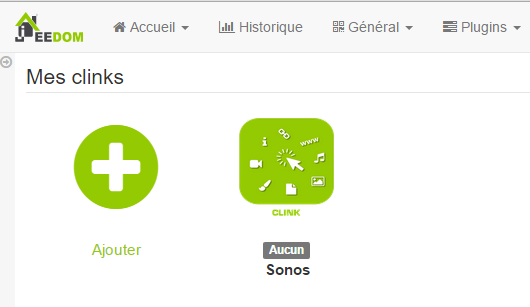

Dieses Plugin ermöglicht die Verwaltung von Links und Ereignissen auf der Oberfläche von
Jeedom. Sie können damit beispielsweise eine Bestellung erstellen, die
öffnet ein Modal (Dialogfenster) mit einer Ansicht, die Ihre enthält
Kameras. Dies ermöglicht zum Beispiel, wenn jemand bei Ihnen zu Hause klingelt
Zeigen Sie die Eingangskamera direkt auf Ihrem Jeedom an.

Plugin Konfiguration 
=======================

Nach dem Herunterladen des Plugins müssen Sie es nur noch aktivieren,
Auf dieser Ebene gibt es keine Konfiguration.

Gerätekonfiguration 
=============================

Die Konfiguration der Clink-Geräte ist über das Menü zugänglich
Plugins :

So sieht die Clink-Plugin-Seite aus (hier mit bereits 1
Ausrüstung) :

> **Spitze**
>
> Platzieren Sie wie an vielen Stellen in Jeedom die Maus ganz links
> ruft ein Schnellzugriffsmenü auf (Sie können unter
> Lassen Sie es in Ihrem Profil immer sichtbar.).

Sobald Sie auf eine davon klicken, erhalten Sie :

Hier finden Sie die gesamte Konfiguration Ihrer Geräte :

-   **Name der Klirrausrüstung** : Name Ihrer Clink-Ausrüstung,

-   **Übergeordnetes Objekt** : gibt das übergeordnete Objekt an, zu dem es gehört
    Ausrüstung,

-   **Aktivieren** : macht Ihre Ausrüstung aktiv,

-   **Sichtbar** : macht Ihre Ausrüstung auf dem Armaturenbrett sichtbar.

Nachfolgend finden Sie die Liste der Bestellungen :

-   **Name** : Der im Dashboard angezeigte Name,

-   **Modus** : der Anzeigemodus des Elements (in einem Modal, in
    ein neues Fenster oder im aktuellen Fenster)

    > **Notiz**
    >
    > Im Handy machen &quot;neues Fenster&quot; und &quot;aktuelles Fenster&quot; dasselbe
    > Sache : Link im aktuellen Fenster öffnen

-   **Typ** : Art des zu öffnenden Elements (Ansicht, Design, Bedienfeld oder URL)

-   **Name** : Option abhängig von dem zum Öffnen ausgewählten Element

-   **Benutzerfilter** : Ermöglicht das Filtern zum Öffnen des Elements
    Nur wenn dieser Benutzer angemeldet ist

-   **Seitenfilter** : erlaubt zu filtern, um das Element nur zu öffnen, wenn
    Wir sind auf der genannten Seite

    > **Notiz**
    >
    > In der mobilen Version bewirkt diese Option nichts

-   **Schnittstellenfilter** : Ermöglicht das Filtern zum Öffnen des Elements
    Nur in der Mobile / Desktop-Version oder auf beiden

-   **Anzeige** : ermöglicht die Anzeige der Daten im Dashboard

-   **Test** : Wird zum Testen des Befehls verwendet,

-   **Löschen** (Zeichen -) : ermöglicht das Löschen des Befehls.

> **Wichtig**
>
> Es ist wichtig, nicht die gleiche Sicht auf sich selbst zu öffnen, ebenso für
> Design !

> **Wichtig**
>
> In Mobilgeräten kann das Öffnen einer URL nicht modal erfolgen
> wie für die Designs.

> **Wichtig**
>
> Nicht alle URLs können modal geöffnet werden, dies hängt von der
> Website (z : google.fr kann nicht modal geöffnet werden). Aufmerksamkeit
> Auch wenn Sie sich in https befinden, muss die Site unbedingt geöffnet werden
> in modal entweder in https.
