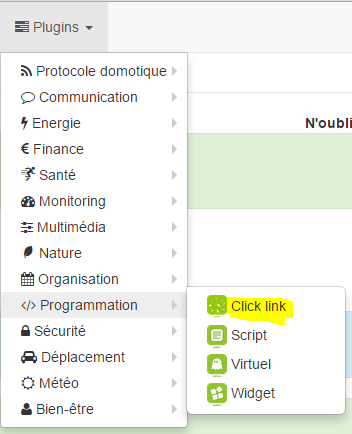

Ce plugin permet la gestion de liens et d’évènements sur l’interface de
Jeedom. Sie können damit beispielsweise eine Bestellung erstellen, die
öffnet ein Modal (Dialogfenster) mit einer Ansicht, die Ihre enthält
caméras. Cela permet par exemple lorsque quelqu’un sonne chez vous
d’afficher directement la caméra de l’entrée sur votre Jeedom.

Plugin Konfiguration 
=======================

Après téléchargement du plugin, il vous suffit juste d’activer celui-ci,
il n’y a aucune configuration à ce niveau.

Gerätekonfiguration 
=============================

Die Konfiguration der Clink-Geräte ist über das Menü zugänglich
Plugins :

So sieht die Clink-Plugin-Seite aus (hier mit bereits 1
Ausrüstung) :

> **Spitze**
>
> Comme à beaucoup d’endroits sur Jeedom, placer la souris tout à gauche
> permet de faire apparaître un menu d’accès rapide (vous pouvez, à
> Lassen Sie es in Ihrem Profil immer sichtbar.

Une fois que vous cliquez sur l’un d’eux, vous obtenez :

Hier finden Sie die gesamte Konfiguration Ihrer Geräte :

-   **Name de l’équipement Clink** : Name Ihrer Clink-Ausrüstung,

-   **Übergeordnetes Objekt** : indique l’objet parent auquel appartient
    l’équipement,

-   **activate** : macht Ihre Ausrüstung aktiv,

-   **sichtbar** : macht Ihre Ausrüstung auf dem Armaturenbrett sichtbar.

Nachfolgend finden Sie die Liste der Bestellungen :

-   **Name** : der auf dem Dashboard angezeigte Name,

-   **Modus** : le mode d’affichage de l’élément (dans une modale, dans
    ein neues Fenster oder im aktuellen Fenster)

    > **Notiz**
    >
    > Im Handy machen &quot;neues Fenster&quot; und &quot;aktuelles Fenster&quot; dasselbe
    > Sache : Link im aktuellen Fenster öffnen

-   **Typ** : type d’élément à ouvrir (vue, design, panel ou URL)

-   **Name** : option en fonction de l’élément choisi à ouvrir

-   **Benutzerfilter** : permet de filtrer pour n’ouvrir l’élément
    que si c’est cet utilisateur qui est connecté

-   **Seitenfilter** : permet de filtrer pour n’ouvrir l’élément que si
    Wir sind auf der genannten Seite

    > **Notiz**
    >
    > In der mobilen Version bewirkt diese Option nichts

-   **Schnittstellenfilter** : permet de filtrer pour n’ouvrir l’élément
    qu’en version mobile/desktop ou sur les 2

-   **Anzeige** : permet d’afficher la donnée sur le dashboard

-   **Test** : ermöglicht das Testen des Befehls,

-   **Entfernen** (Zeichen -) : ermöglicht es Ihnen, die Bestellung zu löschen.

> **wichtig**
>
> Es ist wichtig, nicht die gleiche Sicht auf sich selbst zu öffnen, ebenso für
> Designs!

> **wichtig**
>
> En mobile l’ouverture d’une URL ne peut pas être faite dans une modale
> wie für die Designs.

> **wichtig**
>
> Nicht alle URLs können modal geöffnet werden, dies hängt von der
> Website (z : google.fr kann nicht modal geöffnet werden). Aufmerksamkeit
> Auch wenn Sie sich in https befinden, muss die Site unbedingt geöffnet werden
> in modal entweder in https.
