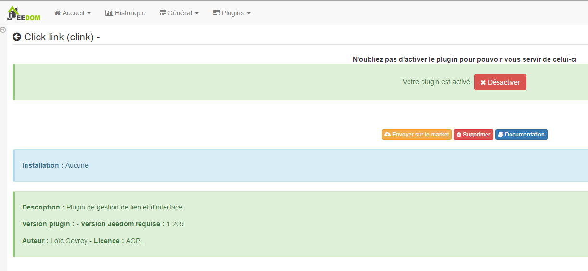

Ce plugin permet la gestion de liens et d’évènements sur l’interface de
Jeedom. You can for example with this create an order which
opens a modal (dialog window) with a view containing your
caméras. Cela permet par exemple lorsque quelqu’un sonne chez vous
d’afficher directement la caméra de l’entrée sur votre Jeedom.

Plugin configuration 
=======================

Après téléchargement du plugin, il vous suffit juste d’activer celui-ci,
il n’y a aucune configuration à ce niveau.

Equipment configuration 
=============================

The configuration of Clink equipment is accessible from the menu
plugins :

This is what the Clink plugin page looks like (here with already 1
equipment) :

> **Tip**
>
> Comme à beaucoup d’endroits sur Jeedom, placer la souris tout à gauche
> permet de faire apparaître un menu d’accès rapide (vous pouvez, à
> from your profile, always leave it visible).

Une fois que vous cliquez sur l’un d’eux, vous obtenez :

Here you find all the configuration of your equipment :

-   **Last name de l’équipement Clink** : name of your Clink equipment,

-   **Parent object** : indique l’objet parent auquel appartient
    l’équipement,

-   **Activate** : makes your equipment active,

-   **Visible** : makes your equipment visible on the dashboard.

Below you find the list of orders :

-   **Last name** : the name displayed on the dashboard,

-   **Fashion** : le mode d’affichage de l’élément (dans une modale, dans
    a new window or in the current window)

    > **Note**
    >
    > In mobile &quot;new window&quot; and &quot;current window&quot; do the same
    > thing : open link in current window

-   **Type** : type d’élément à ouvrir (vue, design, panel ou URL)

-   **Last name** : option en fonction de l’élément choisi à ouvrir

-   **User filter** : permet de filtrer pour n’ouvrir l’élément
    que si c’est cet utilisateur qui est connecté

-   **Page filter** : permet de filtrer pour n’ouvrir l’élément que si
    we are on the page mentioned

    > **Note**
    >
    > In mobile version this option does nothing

-   **Interface filter** : permet de filtrer pour n’ouvrir l’élément
    qu’en version mobile/desktop ou sur les 2

-   **Pin up** : permet d’afficher la donnée sur le dashboard

-   **Test** : allows to test the command,

-   **Remove** (sign -) : allows you to delete the order.

> **Important**
>
> It is important not to open the same view on itself, ditto for
> designs!

> **Important**
>
> En mobile l’ouverture d’une URL ne peut pas être faite dans une modale
> as for the designs.

> **Important**
>
> Not all URLs can be opened in modal, it depends on the
> site (ex : google.fr cannot be opened in a modal). Warning
> also if you are in https, it is imperative that the site to open
> in modal either in https.
