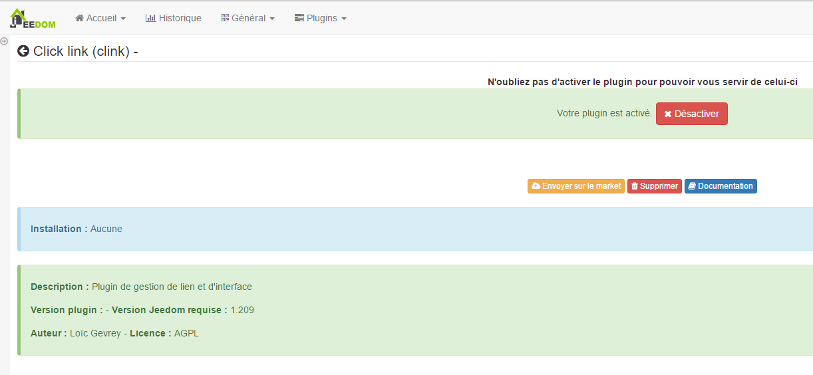
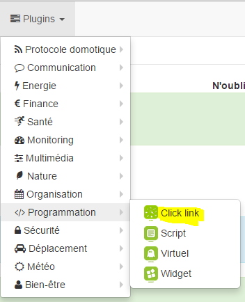
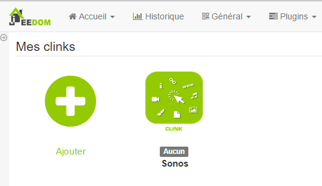
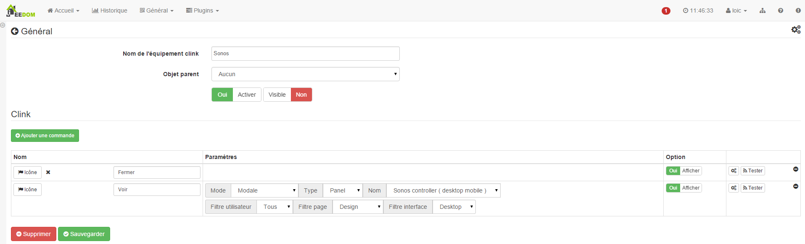

Este complemento permite la gestión de enlaces y eventos en la interfaz de
Jeedom. Por ejemplo, puede crear un pedido que
abre un modal (ventana de diálogo) con una vista que contiene su
cámaras. Esto permite, por ejemplo, cuando alguien llama a su casa
muestra la cámara de entrada directamente en tu Jeedom.

Configuración del plugin 
=======================

Después de descargar el complemento, solo necesita activarlo,
no hay configuración a este nivel.

Configuración del equipo 
=============================

Se puede acceder a la configuración del equipo Clink desde el menú
Plugins :

Así es como se ve la página del complemento Clink (aquí con ya 1
equipos) :

> **Punta**
>
> Como en muchos lugares de Jeedom, coloca el mouse en el extremo izquierdo
> muestra un menú de acceso rápido (puede, en
> desde tu perfil, siempre déjalo visible).

Una vez que haces clic en uno de ellos, obtienes :

Aquí encontrarás toda la configuración de tu equipo :

-   **Nombre de equipo Clink** : nombre de su equipo Clink,

-   **Objeto padre** : indica el objeto padre al que pertenece
    equipo,

-   **Activar** : activa su equipo,

-   **Visible** : hace que su equipo sea visible en el tablero.

A continuación encontrará la lista de pedidos :

-   **Nombre** : el nombre que se muestra en el tablero,

-   **Modo** : El modo de visualización del elemento (en un modo, en
    una nueva ventana o en la ventana actual)

    > **Nota**
    >
    > En el móvil, &quot;nueva ventana&quot; y &quot;ventana actual&quot; hacen lo mismo
    > cosa : abrir enlace en la ventana actual

-   **Tipo** : tipo de elemento para abrir (vista, diseño, panel o URL)

-   **Nombre** : opción según el elemento seleccionado para abrir

-   **Filtro de usuario** : permite filtrar para abrir el elemento
    solo si este usuario ha iniciado sesión

-   **Filtro de página** : permite filtrar para abrir el elemento solo si
    estamos en la página mencionada

    > **Nota**
    >
    > En la versión móvil, esta opción no hace nada

-   **Filtro de interfaz** : permite filtrar para abrir el elemento
    solo en versión móvil / de escritorio o en ambos

-   **Mostrar** : permite mostrar los datos en el tablero

-   **Probar** : Se usa para probar el comando,

-   **Borrar** (signo -) : permite eliminar el comando.

> **Importante**
>
> Es importante no abrir la misma vista en sí mismo, lo mismo para
> Diseños !

> **Importante**
>
> En el móvil, la apertura de una URL no se puede hacer de manera modal
> en cuanto a los diseños.

> **Importante**
>
> No todas las URL se pueden abrir en modal, depende de
> sitio (ex : google.fr no puede abrirse en un modal). Atención
> Además, si está en https, es imprescindible que el sitio se abra
> en modal ya sea en https.
